Below is the rewritten markdown file with all sections and content intact, including the mermaid chart and the detailed installation instructions as provided:

---

# GTK Bank System

🚀 **A Modern Banking Solution with GTK, C, and PDF Receipt Generation**

Welcome to the **GTK Bank System** – a robust desktop banking application designed with **secure transactions**, **PDF receipt generation**, and an **intuitive UI**. Built using **C, GTK, and Cairo**, this project showcases how traditional banking systems can be modernized with elegant graphical interfaces.

---

## 🌟 Why I Built This

I developed this project to demonstrate that **C is not limited to low-level programming**. By integrating **GTK for UI** and **Cairo for PDF generation**, I have built a full-fledged banking system featuring:

- Secure file-based user authentication
- Real-time transaction tracking
- Automatic PDF receipt generation
- Cross-platform compatibility

This project reflects my expertise in **GUI development**, **data persistence**, and **system design** using pure C.

---

## 🎯 Features

✅ **User Authentication**  
✅ **Deposit & Withdrawal with Balance Tracking**  
✅ **PDF Receipt Generation**  
✅ **Password Management**  
✅ **Transaction History**  
✅ **Cross-Platform Support**  

### 🔹 Advanced Receipt System

- ✨ **Auto-Saving** – Transactions generate PDF receipts automatically  
- ✨ **Detailed Records** – Includes timestamp, transaction type, and amounts  
- ✨ **Professional Formatting** – Clean layout with bank branding  
- ✨ **Instant Access** – Opens automatically after generation  

[View Sample Receipt](receipt.pdf)

---

## 📸 Interface Preview

### Login & Deposit


### Withdraw & Receipt


### Security Features


---

## 🌟 Installation

### Prerequisites

#### For Linux:
Ensure you have GTK installed on your system:
```bash
sudo apt update && sudo apt install libgtk-3-dev
```

#### For Windows:
1. **Install GTK**  
   - Download and install **MSYS2** from [https://www.msys2.org/](https://www.msys2.org/).  
   - Open **MSYS2 MinGW 64-bit** and run the following commands to install GTK:
   ```sh
   pacman -S mingw-w64-x86_64-gtk3
   pacman -S mingw-w64-x86_64-gcc
   ```
2. **Add GTK to Path**  
   - Find your MSYS2 installation directory (e.g., `C:\msys64\mingw64\bin`) and add it to your system **Environment Variables** under `Path`.

### Clone the Repository
```bash
https://github.com/Deba-Codex/GTK-Bank-System.git
cd GTK-Bank-System
```

### Compile and Run

#### On Linux:
```bash
gcc Bank_System.c -o Bank_System `pkg-config --cflags --libs gtk+-3.0`
./Bank_System
```

#### On Windows:
```sh
gcc Bank_System.c -o Bank_System.exe `pkg-config --cflags --libs gtk+-3.0`
./Bank_System.exe
```

---

## 🛠 Usage

1. Run the program and enter your **username and password**.
2. If new, a **new account** will be created for you.
3. After login, you can **deposit, withdraw, change password, or view transaction history**.
4. Click **Logout** to switch users securely.
5. The **receipt button** lets you view past transactions.

---

## 🎨 UI & Aesthetics

I've designed the interface to be **clean, minimalistic, and easy to use**. The application is centered on the screen for a **modern feel**, and fonts are optimized for clarity.

> **Enhancing UI/UX in C? YES, IT'S POSSIBLE!**

Icons, colors, and spacing are carefully arranged to **improve usability** while keeping performance optimal.

---

## 📊 System Architecture

```mermaid
graph TD
    A[💻 User Interface] -->|Handles user inputs| B[🔐 Authentication]
    B -->|Validates user credentials| C[💰 Transaction Management]
    C -->|Processes deposits & withdrawals| D[🖨️ PDF Generation]
    D -->|Creates & saves receipts| E[💾 Data Persistence]

    C --> F[📊 Transaction History]
    F -->|Stores & retrieves past records| E


```


## 📚 Project Documentation

- 📄 [View Project Presentation](https://www.canva.com/design/DAGiLRwxaEs/p2jSu8pjOL36WtIpNrVkbA/view?utm_content=DAGiLRwxaEs&utm_campaign=designshare&utm_medium=link2&utm_source=uniquelinks&utlId=ha9b3a7d86e)  
- 📑 [Technical Documentation](GTK_Bank_Technical_Doc.md)

---

## 🤝 Contribution Guide

1. Fork the repository.
2. Create a feature branch (`git checkout -b feature`).
3. Commit your changes (`git commit -am 'Add feature'`).
4. Push to the branch (`git push origin feature`).
5. Open a Pull Request.

---

## 🐝 License

This project is licensed under the **MIT License** – see [LICENSE](LICENSE) for details.

---

## ❤️ Connect

- 📧 **Email:** debasishdash2616@gmail.com  
- 💼 **LinkedIn:** [Debasish Dash](https://www.linkedin.com/in/debasish-dash-276638310/)

**If you find this project useful, don't forget to star ⭐ the repository!**

---